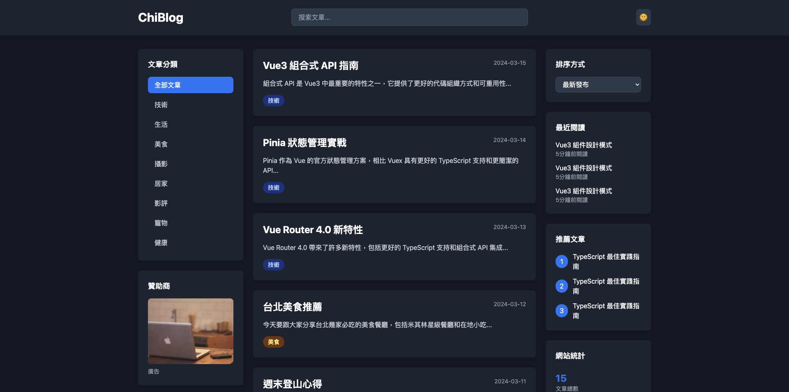

# My Blog

- 前端框架: Vue 3
- 開發語言: TypeScript
- CSS 框架: TailwindCSS
- 路由: Vue Router

## 功能特性

- 文章的增刪改查
- 用戶認證和授權
- 響應式設計
- RESTful API

## 廣告投放

本站支持以下廣告位置：

- 左側邊欄：課程推廣
- 右側邊欄：精選推薦

### 廣告格式要求

- 文件格式：PNG, JPG, WebP
- 最大文件大小：200KB
- 支持深色模式適配

### 廣告追蹤

- 支持點擊追蹤
- 支持展示追蹤
- 提供轉化率分析